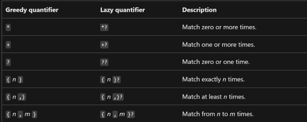
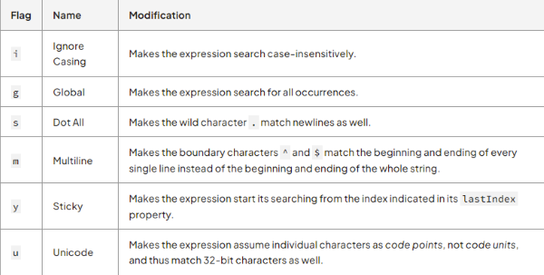

# Regex Tutorial - Email Validator

## What is regex?
- In the world of computer science, we use regular expressions, also known as regex, to validate through a body of text or to locate patterns in the text using specific instructions or parameters that we define ourselves. Some of the most common uses of regex include locating, validating, searching, updating, sorting or filtering through text that match a certain form. 

<br>
<br>

## Table of Contents
- [Anchors](#anchors)
- [Quantifiers](#quantifiers)
- [Grouping Constructs](#grouping-constructs)
- [Bracket Expressions / Class Classes](#bracket-expressions-character-classes)
- [The OR Operator](#the-or-operator)
- [Flags](#flags)
- [Character Escapes](#character-escapes)

<br>
<br>

## Regex Components
- As mentioned above, one of the most common ways that people use regex for is validation purposes. The following is an expression for email validation:

```
- /^([a-z0-9_\.-]+)@([\da-z\.-]+)\.([a-z\.]{2,6})$/
```

- In order to help us fully understand regex as a whole, lets break down this regular expression for email validation into smaller components:

<br>
<br>

### Anchors
- Anchors are a set of instructions that we can write in our regex which specify the location within a particular string to search. These positions can either be before, after, or in between a line of text.   

- In regex, we use the ```^``` (caret) key to match at the beginning of a new line, and we use the ```$``` (dollar sign) to match at the end of the line. 

- In the example above, we can see that there is a ```^``` in the section *before* the ```@``` and there is a ```$``` *after* the ```@``` sign.

```
- /^([a-z0-9_\.-]+) - Match at beginning of a line.
```

```
- ([\da-z\.-]+)\.([a-z\.]{2,6})$/ - Match at the end of a line.
```

<br>
<br>

### Quantifiers
- We use quantifiers to specify or define how many occurances of a character, group, or character class in a body of text happens for a match to be found.

- Quantifiers can be classified in to two sections:
    - Greedy
        - The 'greedy' quantifier will match the **as many occurances** as possible.

    - Lazy
        - The 'lazy' quantifier will match the **least amount of occurances** as possible.


   > A list of all quantifiers [via Microsoft docs](https://docs.microsoft.com/en-us/dotnet/standard/base-types/quantifiers-in-regular-expressions)

<br>

-  Now going back to our email validator above, we can see that there is a ```{2,6}``` in the latter half of the email validator. The ```2``` and ```6``` denotes that there must be a match of a minimum **2** times and a maximum of **6** times.

<br>
<br>

### Grouping Constructs
- Grouping contructs allow us to create or group a subexpression within our regex, and can be executed by wrapping an expression with an opening and closing parenthesis. ```(subexpression here)```

- Grouping contructs can be classified into two kinds:

    - Capturing groups
        - ```(subexpression here)```
            - Denoted by a regular closing and open parenthesis
            - This will only take into account the expression that is written inside the parenthesis.
        - ```(?=subexpression here)```
            - If written with a ```?``` followed by the ```=``` symbol, this will capture the information only if the subexpression is **true** 

    - Non-capturing groups
        - ```(?:subexpression here)```
            - Denoted by a ```?``` followed by a ```:``` inside an open and closing parenthesis
            - This allows us to two or more expressions together (Ex: adding a quantifier group to several subexpressions)
            - **Does not restrict** the information to be captured to only the group that is written inside the grouping construct 

<br>
<br>

- Goin back to our original email validator regex, we can see that we have a total of 3 grouping constructs.
```
^([a-z0-9_\.-]+)@([\da-z\.-]+)\.([a-z\.]{2,6})$/

1. /^([a-z0-9_\.-]+)
2. ([\da-z\.-]+)
3. \.([a-z\.]{2,6})$/
```
- 1. This section targets the username part of the an email, and ```^``` indicates that this part of must be in the beginning of the  line. Ex: ```allecarzadon```@gmail.com
- 2. This section targets the mail server. Ex: allecarzadon@```gmail```.com
- 3. This section targets the domain name, and the ```$``` indicates that this part must be at the end of the line. Ex: allecarzadon@gmail.```com```

<br>
<br>

### Bracket Expressions / Character Classes

- Bracket expressions are used to match any character that is declared inside of an opening and closing bracket. ```[abcd]``` will match letters 'a, b, c or d'

- (```-```) are often used to match a *set* of characters rather than individual characters. ```[a-z]``` will match letter lower cased letters between 'a-z'

- Bracket expressions are **case-sensitive** by default, but you can flag an ```i``` to negate this. ```'allec'.match(/[A-D]/i)``` will match 'a' and 'c'

- Additionally, you can denote a (```^```) inside the opening and closing brackets to indicate a **negative character group**. Instead of matching what is declared inside the bracket, it will match everything else instead. ```[^aeiou]``` will match everything else **except the vowels**

<br>
<br>

```
/^([a-z0-9_\.-]+)@([\da-z\.-]+)\.([a-z\.]{2,6})$/

1. /^([a-z0-9_\.-]+)
2. ([\da-z\.-]+)
3. \.([a-z\.]{2,6})$/
```

- 1. This section indicates that we must match one or more lowercase letters between a-z, numbers between 0-9, underscores, periods, and hyphens

- 2. Next, the mail server restricted to only contain one or more digits, letters between a-z, periods, and hyphens. The domain name is then followed by a period

- 3. Lastly, the third group targets the domain name. It must be between 2-6 characters, and is restricted to letters between a-z

<br>
<br>

### The OR Operator
- Regex  utilizes the OR operator (```|```) to match one of the patterns that is declared. ```abc|def``` will match 'abc' or 'def'

<br>
<br>

### Flags
- Flags are used in regex to affect the searches that are declared inside the expressions. They are optional and can be denoted following this pattern: 

```
/subexpression-here/flag-here

/A-Z/i - Will match any letters A-Z, including lower case letters.
```

   > A list of all flags [via codeguage](https://www.codeguage.com/courses/regexp/flags)

<br>
<br>

### Character Escapes
- In regex, there are characters that are **reserved** characters, meaning that they have have a special meaning. In order to match for these special characters, we use the (```\```) before the character to match its literal character.
- Special characters include:
```
., +, ?, ^, $, (, ), [, ], {, }, |, \
```
- Ex: 'Allec\?' will match 'Allec?'


## Author
- [Github Profile - Axe714](www.github.com/axe714)
- For inquiries/questions, please reach out to me at allec@gmail.com